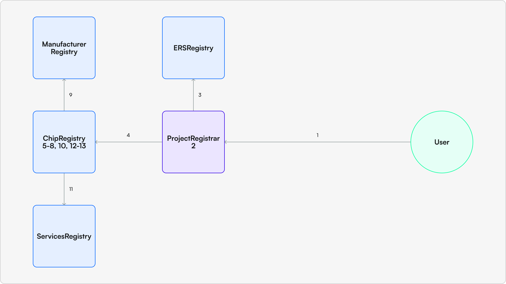

# Claiming Chips

## What Does Claiming Do?
When a user claims a chip they are creating a digital representation of the chip, called a PBT (see [What is a PBT](pbt.md)), and tying it to the physical chip within the ERS system. By claiming the digital representation the claimer is able to start adding various services to their chip which can be resolved to when the chip is scanned. 

Practically, claiming a chip ties two pieces of information to the chip:
1. The claimer's ERS name - this looks like [name].project.tsm.ers
2. A `primaryService` - This is the service that your chip will default bring up on resolution, see [Understanding Services](services.md) for more information on services.

Once claimed you can add additional services to be resolved by clients, these could be ticketing services or other experiences that you want to be able to resolve to when the chip is scanned.

## How to Claim a Chip


All chip claims are processed by the `ProjectRegistrar` associated with the project the chip is enrolled in. `ProjectRegistrar`s are not created by the ERS system, instead they are created by the project owner and are responsible for managing the enrollment of chips into the project. This means that the data requirements may differ depending on the project, however each `ProjectRegistrar` is required to do two things:
1. Call the `ERSRegistry` to create an ERS name for the chip being enrolled (Step 3)
2. Call the `ChipRegistry` to enroll the chip in the system (Step 4)

When calling the `ChipRegistry` the `ProjectRegistrar` must provide the following data:
- `chipId` - the unique identifier for the chip
- `chipClaimData` - struct containing data required to validate the chip's inclusion in the project, chip owner address, and the chip's ERS node
- `manufacturerValidation` - struct containing data required to validate the chip's enrollment in the system
- `tsmCertificate` - Signature proving the TSM acknowledges the chip as part of the project
- `custodyProof` - Signature proving the chip was custodied by the project at some point

The `chipClaimData` struct is defined as follows:
```
    struct TSMMerkleInfo {
        uint256 tsmIndex;
        bytes32 serviceId;
        uint256 lockinPeriod;
        string tokenUri;
        bytes32[] tsmProof;
    }

    struct ChipClaim {
        address owner;
        bytes32 ersNode;
        TSMMerkleInfo tsmMerkleInfo;
    }
```
In order for the claim to go through the chip must:
1. Not have been previously claimed by ANY project
2. Have the correct `ERSRegistry` state set by the `ProjectRegistrar`
3. Have valid Manufacturer and project inclusion proofs (Step 9)
4. Have valid certificates from the TSM

Once the claim is validated the primaryService for the chip is set in the `ServicesRegistry` (Step 11). __See below for more granular step-by-step of the flow.__

## Example: Claiming a Chip
For an example of claiming a chip see [Claiming A Chip](../../scripts/chip-claim.md) section in our scripts documentation.

## Appendix: Technical Step-by-Step
Step by step explanation of above image:

1. End-user submits a message signed by the chip (ownershipProof) calling a `claim` function on the ProjectRegistrar (TSMs could have one registrar per project) submitting the following:
    - `tsmIndex` - index of tsm merkle proof
    - `enrollmentId`
    - `primaryServiceId`
    - `lockinPeriod`
    - `tokenUri`
    - TSM merkle proof
    - `tsmCertificate`
    - `custodyProof`
    - `mIndex` - index of manufacturer merkle proof
    - Manufacturer merkle proof
2. Registrar validates and updates any of its own state that it wants to
3. Registrar calls ERSRegistry setting subnode with chip as resolver and specifying owner
4. Registrar calls a claim function on the ChipRegistry (now passing along the chipId)
5. Check that chip hasn’t already been claimed
6. ChipRegistry validates that the tsmCertificate was signed by the TSM
7. ChipRegistry validates that the custodyProof was signed by the chip
8. ChipRegistry validates chip exists in merkle tree by passing in index, chipId, enrollmentId, primaryServiceId, tokenUri, and lockinPeriod
9. ChipRegistry calls ManufacturerRegistry with chipId, enrollmentId, and manufacturer merkle proof to make sure it's an enrolled chip
10. If not an enrolled chip revert, else write chipId, primaryServiceId, enrollmentId, and owner address to state
    - enrollmentId will be used to find chip-related specification`
11. ChipRegistry calls ServiceRegistry to set primaryServiceId for the chip
12. Mint PBT
13. ChipRegistry sets all necessary state in ChipInfo

