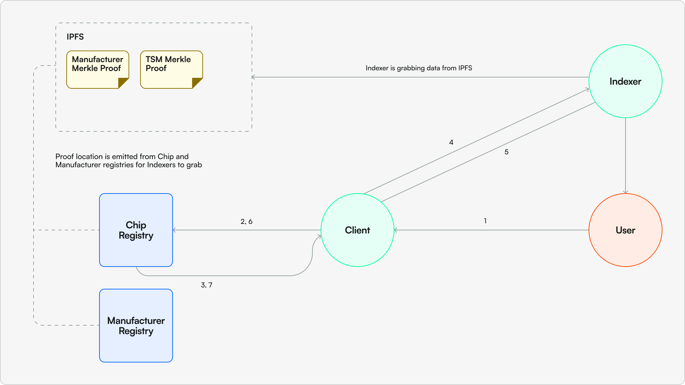

# Understanding Chip Resolution

## Problem and Purpose
A core feature of ERS is that all chips should be able to resolve to a service, whether IPFS based app or a standard web app. In order to reliably resolve we need to be able to:
1. Verify the chip has been correctly enrolled in ERS
2. Be able to return a service address for the chip

Step 2 is relatively easy, since an service address is a small amount of data it can be stored on-chain and managed through our ServiceRegistry. Step 1 however presents some challenges due to the amount of data required to be able to prove a chip has been validly enrolled in ERS. In order to validate enrollment in ERS we must provide the following information:
- Project Merkle leaf data
    - Merkle leaf index
    - chipId
    - enrollmentId
    - lockinPeriod
    - serviceId
    - tokenUri
- Project Merkle Proof
- TSM Certificate
- Custody Proof
- Project Merkle leaf data
    - Merkle leaf index
    - enrollmentId
    - chipId
- Manufacturer Merkle Proof

Storing all this information on-chain would be prohibitively expensive so we need to store it somewhere off-chain and be able to trust that we're getting the correct data to verify the chip is correctly enrolled.

## Fetching Off-Chain Data

In order to fetch off-chain data we use the [EIP-3668 standard](https://eips.ethereum.org/EIPS/eip-3668), also known as CCIP-read. For a more general explainer of CCIP-read we encourage you to read the standard, but here we'll provide the series of steps as tailored to the ERS protocol:
1. User requests chip resolution via a EIP-3668 enabled client, by passing in `chipId`
2. Client takes `chipId` and passes to `resolveChipId` on the `ChipRegistry`
3. Assuming chip hasn't been claimed, the `OffChainLookup` error is thrown returning an array of gateways to check for validation data, params to call the gateway with, and a callback function on the smart contract
4. Client calls one or multiple gateways from the returned array with the provided params
5. Gateway returns all data to the client encoded into bytes, see Appendix for structure of data, which is then validated and used to return the correct Service Records
6. Client calls the callback function (`resolveUnclaimedChip`) and receives an array of Service Records it can redirect to
7. Client either redirects or offers the user a choice of services to redirect to

The above represents the general flow, the following sections will highlight what to expect depending on the state of the chip within ERS.

## Resolution States
There are 4 main resolution states a chip can be in:
1. Claimed
2. Unclaimed - Enrolled in a Project 
3. Unclaimed - Enrolled by a Manufacturer
4. Unenrolled

### Claimed
When a chip has already been claimed resolution is easy and does not require the full CCIP-read flow. Instead, in Step 3 the client will return an array Service Records associated with the primary service set for the chip, instead of erroring out, thus not invoking the call to the gateway.

### Unclaimed - Enrolled in a Project
When a chip hasn't been claimed but has been enrolled in a project the full CCIP-read flow will play out behind the scenes. The gateway will return an array of potentially valid data blobs which are iterated over until a valid blob is found. From this we can get the intended initial primary service for the chip which we can use to return an array of Service Records to the client.

### Unclaimed - Enrolled by a Manufacturer
When a chip hasn't been enrolled in a project it should still be enrolled by a manufacturer if it is a part of the system. In this case there will only be a valid data blob for the Manufacturer Merkle tree which allows us to validate it's enrollment in the system and thus the protocol returns the Manufacturer's bootloader app.

### Unenrolled
If the chip is unenrolled it will not be resolvable within the system and thus a revert will be thrown if it's attempted.

## Resolving a Chip
Putting all of these pieces together we can add the validation component of the flow to see how a chip is resolved. We've been a bit vague about the data returned from the gateway but it exists of two main components:
1. TSM Entries - the number of TSM entries in the TSM entry array. Each TSM entry represents a project enrollment and contains all the data required to validate the chip's enrollment in the project (Project Merkle tree and certificates). There should only be one TSM entry per chip, however we should not treat the gateway as a trusted source and thus we must validate all entries.
2. Entries - This is the array containing all of the data blobs to be processed. The array length should be equal to TSM Entries + 1 because the last entry in the array is the Manufacturer Merkle tree data blob.

Checks are done to ensure data integrity, primarily checking that the length of the `entries` array is what we expect. Then we cycle through the array, if a valid TSM Entry is found then we get the serviceId from the entry and use it to fetch the Service Records from the ServiceRegistry. If no valid TSM Entry is provided we check the Manufacturer Merkle tree entry which, if valid, returns the bootloader app address. If no valid TSM Entries or Manufacturer Entry exists then the call is reverted and chip is not resolved.

## Encoding Resolution Data
This means that the data encoded by the gateway adheres to the following high-level structure:
```
abi.encode([uint8, bytes[]], [tsmEntries, entries])
```

The `entries` array is structured as follows:
```
[tsmEntry1, tsmEntry2, ..., tsmEntryN, manufacturerEntry]
```
Where each `tsmEntry` is structured as follows:
```
abi.encode([bytes32, address, TSMMerkleInfo, bytes, bytes], [enrollmentId, projectRegistrarAddress, tsmMerkleInfo, tsmCertificate, custodyProof])
```
The definition for `TSMMerkleInfo` is as follows:
```
struct TSMMerkleInfo {
    uint256 tsmIndex;
    bytes32 serviceId;
    uint256 lockinPeriod;
    string tokenUri;
    bytes32[] tsmProof;
}
```
And the `manufacturerEntry` is simply the encoded ManufacturerValidation struct which is defined as follows:
```
struct ManufacturerValidation {
    bytes32 enrollmentId;
    uint256 mIndex;
    bytes32[] manufacturerProof;
}
```
