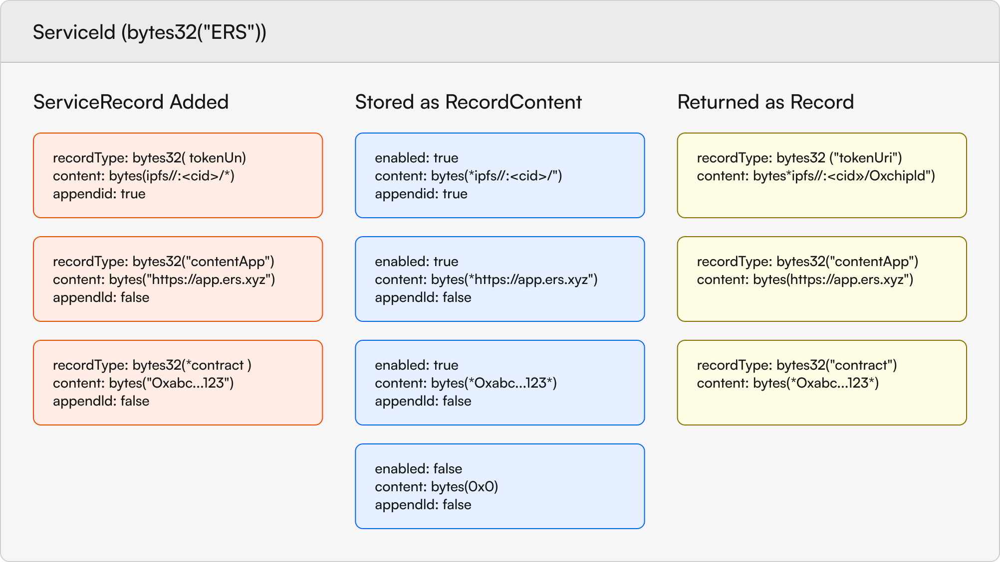

# Understanding Services

## What are Services?

Services are how chip holders tie content to their chip and how TSMs can push new content to their chip holders. Services are identified by their unique `serviceId` that is granted upon creation. Service IDs are just a hash of the service's name, given out on a first come first serve basis. Services contain a list of records that offer different experiences or ways to resolve the service. A `ServiceRecord` is structured as such:
```
    struct ServiceRecord {
        bytes32 recordType;
        bytes content;
        bool appendId;
    }
``` 
### Record Type
Where `recordType`s are the `bytes32` representation of some string (ie bytes32("tokenUri") or bytes32("contentApp")), it is expected that UI's integrating with ERS will know how to handle these different record types. While there is no on-chain directory of valid record types, community consensus will likely form around a set of standard record types. There are two record types that have special meaning in the system:
1. `tokenUri` - In the case a `tokenUri` wasn't defined when the chip was claimed (and chip's PBT minted), the `tokenUri` record associated with the `primaryService` of the chip becomes the chip / PBTs `tokenUri`
2. `contentApp` - The `contentApp` of the `primaryService` is the record that is resolved to when a chip is scanned

### Content
The content in a `ServiceRecord` is just a `bytes` array that can be interpreted by the UI. For example, if the `recordType` is `tokenUri` then the `content` should be a valid IPFS URI that points to the token's metadata. If the `recordType` is `contentApp` then the `content` should be a valid IPFS or Web App URI that points to the content. This field could also potentially hold contract addresses, or any other content the service owner wants to be able to resolve to.

### Append ID
This option exists to be able to append the chipId to the end of the `content` string. This is particularly useful for `contentApp`s that want to provide unique experiences for each chip or `tokenUri`s that have unique content per chip.

## Primary vs Secondary Services
We've made reference to primary services a few times now, but what does that mean? Primary services act as the "default" service for a given chip. This means when resolving the chip it will always resolve to the `contentApp` of the `primaryService`. Primary services can be locked in for a time period up to __1__ year, this is to make sure that the issuing project is able to assert some control over content tied to the chip for a period of time post-claim. However, once this time period has elapsed the chip holder is free to change their primary service to whatever they want. This is done by calling `setNewPrimaryService` on the `ChipRegistry` and passing in the `serviceId` of the service you want to set as your primary service. It is worth noting that you cannot have the `primaryService` also be a secondary service.

Secondary services are other services that the chip holder wants to tie to the chip. This could be some sort of attestation service for example. While the chip won't resolve to these services by default, clients can be created that surface secondary services tied to the chip, thus making them easy to navigate to. Secondary services can be added by calling `addSecondaryService` on the `ChipRegistry` and passing in the `serviceId` of the service you want to add. This will add the service to the chip's list of services and make it resolvable by clients.

## Example: Creating a Service
For an example of creating a service see [Creating A Service](../../scripts/create-service.md) section in our scripts documentation.
