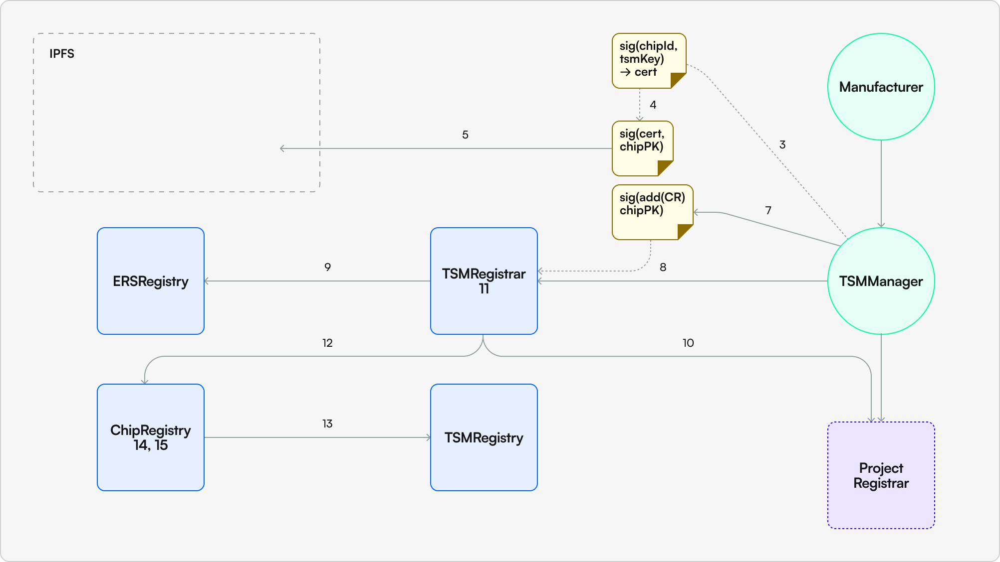

# What Are TSMs?
TSMs are modeled after Trusted Service Managers common to mobile networks. These actors take custody of chips from manufacturers and distribute manufacturer enrolled chips to end users or other projects that are building on top of the TSM's infrastructure.

## How is a TSM added?
TSMs can only be added by governance. In order to add a TSM the TSM must commit to a ers name they wish to use, creating a `[tsm].ers` name. This subdomain will be used to identify all projects launched under the TSM since all project ERS names will then have the format `[project].[tsm].ers`. 

Adding a TSM is a two-step process:
1. Once the TSM has selected their name it is passed in along with a `_tsmOwner` address to the `addAllowedTSM` function on the `TSMRegistry`
2. After step 1 is completed the TSM calls `createNewTSMRegistrar` which deploys a new `TSMRegistrar` contract that is owned by the `_tsmOwner` address. This contract is used to manage the TSM's projects. When calling `createNewTSMRegistrar` the caller can select an implementation of `TSMRegistrarFactory` they wish to use. Once deployed the implementation cannot be changed. `TSMRegistrarFactories` are permissioned implementations that can only be added by governance.

### Real-World Example

To better understand the concept of TSMs and their projects, let's consider a real-world example.

Imagine a TSM called `CoolNFTShoes`. In the ERS system, they would have a name like `CoolNFTShoes.ers`.

Now, let's say `CoolNFTShoes` launches their first project, a limited edition shoe called `AirForceTwos`. In the ERS system, this project would be identified as `AirForceTwos.CoolNFTShoes.ers`.

So, in this example, `CoolNFTShoes.ers` is the TSM, and `AirForceTwos.CoolNFTShoes.ers` is a project launched by that TSM. This naming convention helps to clearly identify the TSM and the specific projects they launch.

## What can TSMs do?
Once the TSM has their `TSMRegistrar` deployed they can begin adding projects. TSMs have two options for adding projects:
1. TSMs can manually add projects with brands / companies that they personally vet by calling `addProject` on their `TSMRegistrar` from the owner address of their `TSMRegistrar`
2. They can change the owner of their `TSMRegistrar` to another contract address which handles permissioning and any other requirements the TSM wants to impose on projects using it's infrastructure. This contract can then call `addProject` on the `TSMRegistrar` to add projects.

## Adding Projects
In order to add a project the following information must be provided:
- **Name Hash**: The hash of the project's name. This is used to ensure that the project name is unique, and creates the `[project].tsm.ers` name for the project.
- **Project Registrar**: The address of the project's registrar. This is the contract that will be used to manage the project's chips. End-users will go here to claim their chips. The registrar must implement the `ProjectRegistrar` interface.
- **Project Merkle Root**: Similar to the manufacturer merkle root tree this is used to validate inclusion of the chip in the project, and hence the prove that the chip was distributed by the project / TSM. The project merkle tree leaves contain much more data than the manufacturer's, see below for a description of the data structure.
- **Project Public Key**: This is the public key of the project. The `projectPublicKey` is the key used to sign all TSM certificates and is also the address signed by each chip in order to create chip custody proofs (in order to prove that the TSM actually had physical ownership of the chip)
- **Transfer Policy**: The address of the transfer policy contract the project instantiates the chip with. This transfer policy contract defines how the PBT ([see PBT section](pbt.md)) representation of the chip can be transferred on-chain. Once the chip is claimed, the end-user can change the transfer policy to whatever they want ([see PBT section](pbt.md) for further information on transfer policies).
- **Ownership Proof**: This is a signature of the `chainId` packed with the `ProjectRegistrar` address by the `projectPublicKey`. This signature is used to prove that the `projectPublicKey` is actually owned by the caller of the `addProject` function. Without this other projects could take the TSM certificates signed by another project's `projectPublicKey` and try to pass them off as their own.
- **Project Claim Data URI**: This is an IPFS URI that is stored on-chain. This URI points to the Project Merkle proofs for each chip in the project enrollment. In order to claim a chip the claimer needs to find their chip information at this URI.

Once a project has been added you can see the project's information by calling `projectEnrollments` on the `ChipRegistry` and passing in the `ProjectRegistrar` address of the project. Additionally, this opens up the ability for end-users to claim chips from the project via the `ProjectRegistrar`.

## Example: Creating a Project
For an example of creating a project see [Creating A Project](../../scripts/create-project.md) section in our scripts documentation. Additionally, see a step-by-step explainer of all the interactions required to create a project:

1. TSM receives list of chipIds and enrollmentId from manufacturer
2. Optional: TSM can check against the ManufacturerRegistry to verify that all chips have been correctly enrolled by manufacturer
3. TSM signs public key of every chip with their own private key / public key pair (certificate)
    - The key used to sign we call the projectPublicKey and is defined on a per project basis
4. TSM signs resulting signature from Step 3 with its matching chip
5. TSM places certificate in IPFS
6. TSM deploys ProjectRegistrar with the following information (in whatever data structure they want):
    - TSMRegistrar address
    - ChipRegistry address
7. TSM signs deployed ProjectRegistrar address with same key used to sign all the chips
8. TSMManager calls addProject on its TSMRegistrar using its “owner” address and passing in
    - Enrollment nameHash
    - ProjectRegistrar address
    - Project public key used to sign certificates (see Step 3 above)
    - merkleRoot
    - Transfer policy
    - A signed message of the ProjectRegistrar address using the TSM public key
    - URI pointing to the location to find claim data for the project
9. TSMRegistrar calls ERSRegistry passing rootNode, nameHash, and ProjectRegistrar address to create subNode and set ProjectRegistrar as the owner
10. TSMRegistrar calls project’s ProjectRegistrar and writes subNode to its rootNode state
11. TSMRegistrar pushes ProjectRegistrar address into its projects array
12. TSMRegistrar calls addProjectEnrollment on ChipRegistry passing in the 
    - Registrar address
    - TSMs public key used to sign certificates
    - Signed registrar address using TSMs public key
    - Merkle root for claiming chips (same root as in step 8d)
    - Transfer policy for the chip to use
    - URI pointing to the location to find claim data for the project
13. ChipRegistry calls TSMRegistry checking that calling address is a TSMRegistrar
14. ChipRegistry checks that signed address resolves to TSMs public key in order to validate they own the address (we will be checking to make sure that the certificates submitted during the claim process are signed by this address as well)
15. Save merkle root to ChipRegistry in enrollment mapping under ProjectRegistrar address

